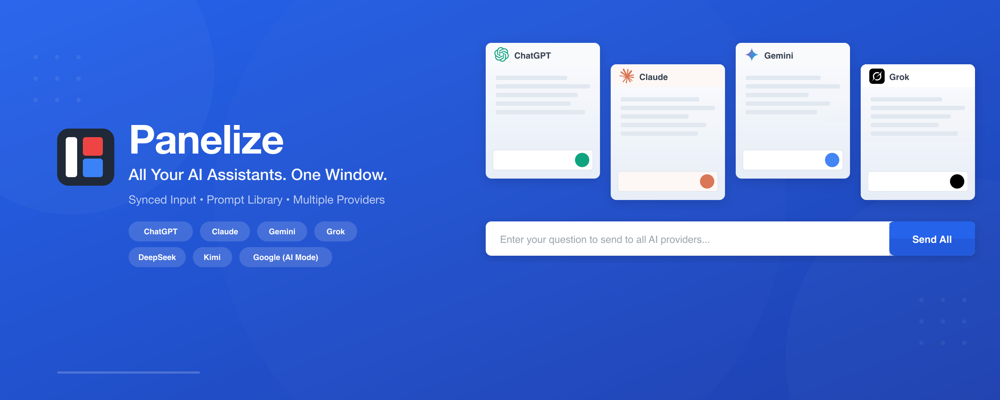
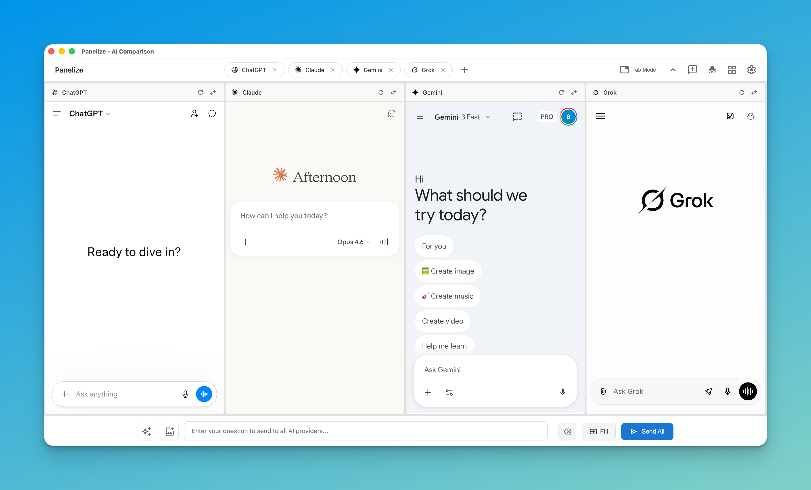
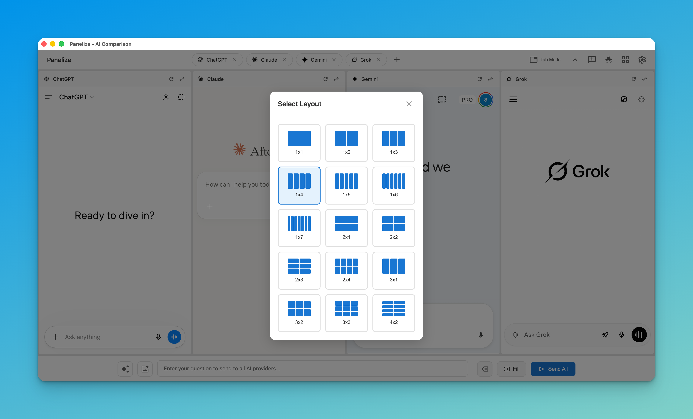
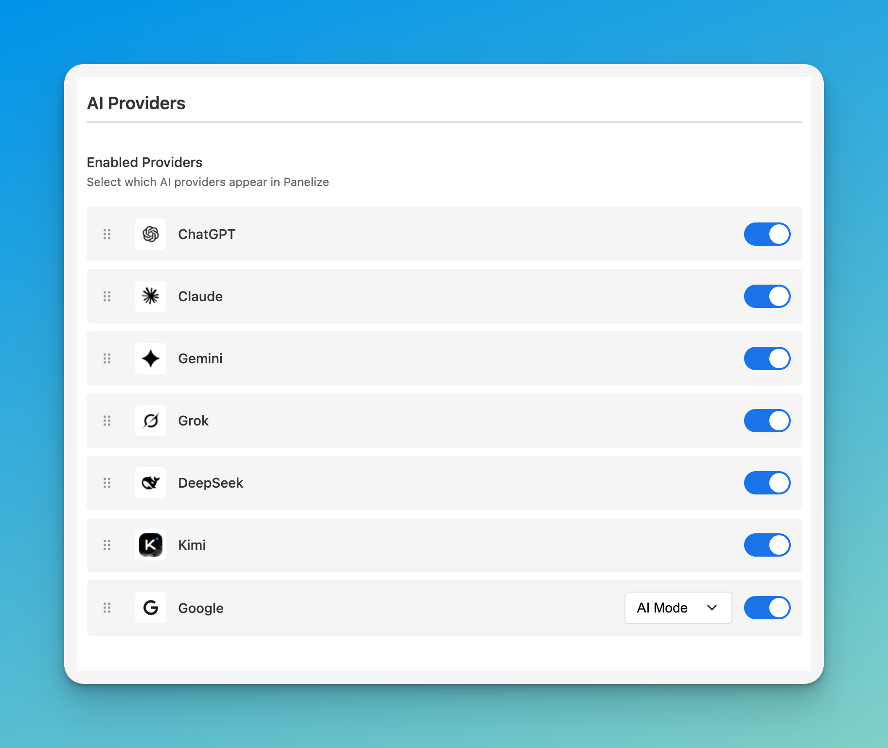

# Panelize

  <a href="README.md"><strong>English</strong></a> |
  <a href="README.zh-CN.md"><strong>简体中文</strong></a> |
  <a href="README.ja.md"><strong>日本語</strong></a>

  

  <strong>タブ切り替えをやめて、複数 AI の回答を1画面で比較。</strong>

  
  
  
  
  

---

## Panelize とは？

同じプロンプトを複数の AI タブに貼り付けて比較する作業を、1つの画面にまとめる拡張機能です。

**1つの入力で、複数 AI の回答を同時に比較できます。**

  

---

## 主な機能

### 1回の入力で同時送信

統一入力欄から ChatGPT / Claude / Gemini / Grok / DeepSeek / Kimi / Google AI Mode へ同時に送信できます。

### 柔軟なレイアウト

15種類のレイアウトを用意。2モデルの比較から多モデルの検証まで対応します。

  

### 初期設定ほぼ不要

API キー不要。通常どおり各 AI サービスにログインしていれば利用できます。

### Prompt Library

よく使うプロンプトを保存して再利用可能。`{topic}` などの変数にも対応。

### プライバシー重視

- データはブラウザ内に保存
- トラッキングなし、分析なし
- オープンソース

---

## 対応 AI プロバイダー

- ChatGPT
- Claude
- Gemini
- Grok
- DeepSeek
- Kimi
- Google AI Mode

  

---

## インストール

### Chrome Web Store（推奨）

1. [Chrome Web Store ページ](https://chromewebstore.google.com/detail/panelize/iokalaafkmjffolodkkgbbccmofbglii) を開く
2. **Add to Chrome** をクリック
3. インストール後、`Cmd/Ctrl + Shift + E` で Panelize を開く

> **Edge でも利用可能：** Chrome Web Store からそのままインストールできます。

<strong>手動インストール（開発者向け）</strong>

1. このリポジトリのソースコードをダウンロード
2. `chrome://extensions/`（または `edge://extensions/`）を開く
3. デベロッパーモードを有効化
4. 「パッケージ化されていない拡張機能を読み込む」でフォルダを選択

---

## クイックスタート

1. **各 AI サービスへログイン**（通常のブラウザタブで事前ログイン）
2. **`Cmd/Ctrl + Shift + E` を押す**
3. **レイアウトを選ぶ**
4. **入力して送信**（全パネルへ同時反映）

---

## キーボードショートカット

| 操作 | ショートカット |
|------|----------------|
| Panelize を開く | `Cmd/Ctrl + Shift + E` |
| Prompt Library を開く | `Cmd/Ctrl + Shift + L` |

`chrome://extensions/shortcuts` で変更できます。

---

## トラブルシューティング

**ログイン画面が表示される場合**
→ 先に通常タブで対象サービスへログインし、Panelize を再読み込みしてください。

**ショートカットが動作しない場合**
→ `chrome://extensions/shortcuts` で競合を確認してください。

**サポートが必要な場合**
→ [Issue を作成](https://github.com/Manho/Panelize/issues)

---

## コントリビューション

コントリビューション歓迎です。

- 🐛 バグ報告
- 💡 機能提案
- 🌍 翻訳の改善
- 🔧 Pull Request

---

## License

MIT License。詳細は [LICENSE](LICENSE) を参照してください。
