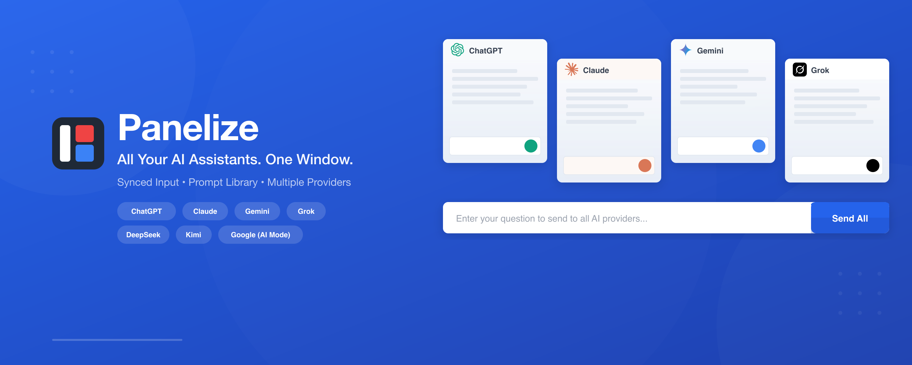
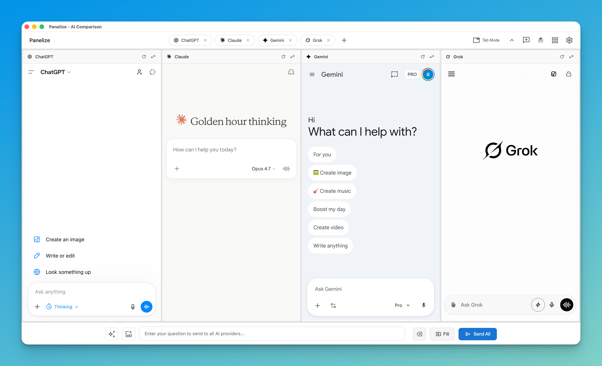
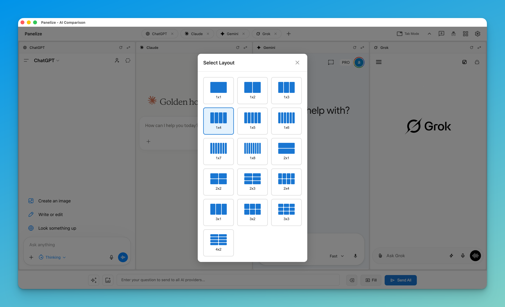
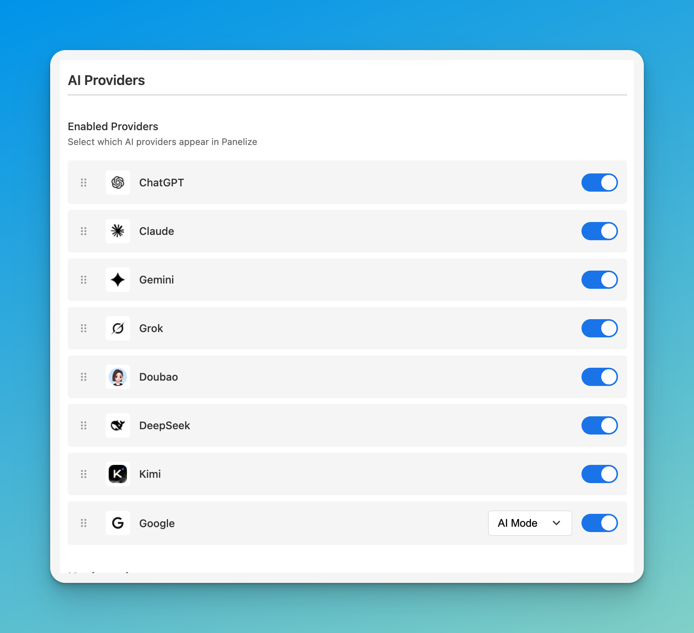

# Panelize

<p align="center">
  <a href="README.md"><strong>English</strong></a> |
  <a href="README.zh-CN.md"><strong>简体中文</strong></a> |
  <a href="README.ja.md"><strong>日本語</strong></a>
</p>

<p align="center">
  
</p>

<p align="center">
  <strong>Stop switching tabs. Start comparing AI responses side by side.</strong>
</p>

<p align="center">
  
  
  
  
  
</p>

---

## Why Panelize?

Ever found yourself copying the same prompt across multiple AI tabs just to compare answers? Panelize eliminates that workflow entirely.

**One window. One prompt. Multiple AI responses—instantly.**

<p align="center">
  
</p>

---

## Features at a Glance

### 🎯 Ask Once, Compare All

Type your question once and send it to ChatGPT, Claude, Gemini, Grok, Doubao, DeepSeek, Kimi, Qwen, Zhipu (China), Z.ai (Global), Yuanbao, and Google simultaneously. See which AI gives you the best answer—no tab switching required.

### 📐 Flexible Layouts

Choose from 22 different layouts to fit your workflow. Need a quick 2-way comparison? Use 1×2. Deep research across 12 models? Try 1×12 or 2×6. The choice is yours.

<p align="center">
  
</p>

### ⚡ Zero Setup

No API keys. Log into your AI accounts normally, and Panelize uses those sessions.

### 📚 Prompt Library

Save your best prompts and reuse them across all providers. Supports variables like `{topic}` for quick customization.

### 🔒 Privacy First

- One-click privacy mode across supported providers
- All data stays in your browser—nothing leaves your machine
- No tracking, no analytics, no data collection
- Open source—review the code yourself

---

## Supported AI Providers

<table align="center">
  <tr>
    <td align="center"><strong>ChatGPT</strong></td>
    <td align="center"><strong>Claude</strong></td>
    <td align="center"><strong>Gemini</strong></td>
    <td align="center"><strong>Grok</strong></td>
  </tr>
  <tr>
    <td align="center"><strong>Doubao</strong></td>
    <td align="center"><strong>DeepSeek</strong></td>
    <td align="center"><strong>Kimi</strong></td>
    <td align="center"><strong>Google</strong></td>
  </tr>
  <tr>
    <td align="center"><strong>Qwen (China)</strong></td>
    <td align="center"><strong>Qwen (Global)</strong></td>
    <td align="center"><strong>Zhipu (China)</strong></td>
    <td align="center"><strong>Z.ai (Global)</strong></td>
  </tr>
  <tr>
    <td align="center"><strong>Yuanbao</strong></td>
    <td></td>
    <td></td>
    <td></td>
  </tr>
</table>

<p align="center">
  
</p>

---

## Installation

### Chrome Web Store (Recommended)

1. Visit the [Chrome Web Store](https://chromewebstore.google.com/detail/panelize/iokalaafkmjffolodkkgbbccmofbglii) page
2. Click **"Add to Chrome"**
3. Done! Press `Cmd/Ctrl + Shift + E` to open Panelize

> **Works on Edge too:** Install directly from the Chrome Web Store.

<details>
<summary><strong>Manual Installation (for developers)</strong></summary>

1. Download the source code from this repository
2. Go to `chrome://extensions/` (or `edge://extensions/`)
3. Enable "Developer mode"
4. Click "Load unpacked" and select the extracted folder

</details>

---

## Quick Start

1. **Log into your AI accounts** — Visit ChatGPT, Claude, etc. and log in as usual
2. **Press `Cmd/Ctrl + Shift + E`** — Opens the Panelize window
3. **Pick a layout** — Choose how many AI panels you want
4. **Type and send** — Your prompt goes to all panels at once

That's it. No accounts to create, no API keys to configure.

---

## Keyboard Shortcuts

| Action | Shortcut |
|--------|----------|
| Open Panelize | `Cmd/Ctrl + Shift + E` |
| Open Prompt Library | `Cmd/Ctrl + Shift + L` |

Customize shortcuts at `chrome://extensions/shortcuts`

---

## Troubleshooting

**AI provider shows login page?**
→ Log into that provider in a regular browser tab first, then refresh Panelize.

**Shortcuts not working?**
→ Check for conflicts at `chrome://extensions/shortcuts`

**Need more help?**
→ [Open an issue](https://github.com/Manho/Panelize/issues)

---

## Development and Testing

```bash
npm install
npx playwright install chromium   # browser used by the e2e and live suites
```

With Playwright 1.58, `npx playwright install` can hang while it extracts the download under Node 26. The install then stays incomplete. If that happens, stop it and run the install once with Node 24 (for example `nvm exec 24 npx playwright install chromium`). The e2e suite then uses the installed browser under any Node version.

| Command | What it runs |
| --- | --- |
| `npm test` | Unit and integration tests (Vitest + happy-dom) |
| `npm run test:e2e` | Extension e2e tests: the real extension against local fixture sites, headless and in parallel |
| `npm run test:e2e:headed` | Same, with visible windows for debugging (or set `PANELIZE_E2E_HEADED=1`) |
| `npm run test:live:login` | Opens the live-test profile in a normal browser window so you can log in to providers |
| `npm run test:live` | Smoke checks against the real provider sites (manual, not part of CI) |

### Live smoke tests

The live suite catches provider site changes that fixtures cannot. For each provider it opens the real multi-panel page, types into the unified input, and presses **Fill**. It then checks that the text reached the provider's composer and that the send and new-chat selectors still match. Without `PANELIZE_LIVE_SEND` it then clears the composer and reloads the panel to confirm that no test text stays behind as a saved draft.

1. Run `npm run test:live:login` and log in to each provider. If a panel still looks logged out, log in inside that panel on the multi-panel tab, because panel iframes use partitioned storage. Quit the browser when you are done (Cmd+Q on macOS); with more than 12 providers the next batch then opens. The logins are kept in the profile, so this is a one-time step.
2. Run `npm run test:live`, ideally before every release. By default it opens a visible window, because several sites block headless browsers.
3. Failures save a screenshot and the provider frame's HTML under `test-results/live/`.

| Variable | Default | Meaning |
| --- | --- | --- |
| `PANELIZE_LIVE_PROFILE` | `~/.panelize-live-profile` | Profile directory that keeps the logins |
| `PANELIZE_LIVE_PROVIDERS` | all providers | Comma-separated ids, e.g. `chatgpt,doubao` |
| `PANELIZE_LIVE_SEND` | off | `1` actually sends the prompt, which uses provider quota |
| `PANELIZE_LIVE_HEADLESS` | off | `1` runs headless; expect Cloudflare challenges on some sites |

---

## Contributing

Found a bug? Have an idea? Contributions are welcome:
- 🐛 Report bugs via [GitHub Issues](https://github.com/Manho/Panelize/issues)
- 💡 Suggest features
- 🌍 Help translate to more languages
- 🔧 Submit pull requests

---

## License

MIT License — see [LICENSE](LICENSE) for details.

---

<p align="center">
  <strong>Open source & privacy-focused</strong><br>
  Available in 10 languages
</p>

<p align="center">
  <sub>Made for everyone who's tired of tab-switching between AI assistants.</sub>
</p>
